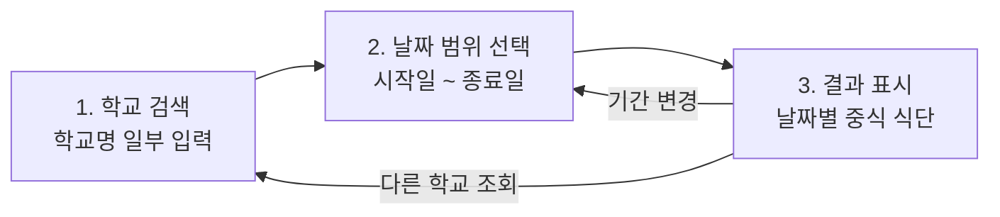

# 급식 배틀 - 학교 급식 조회 앱 (PRD)

## 1. 개요

**급식 배틀 - 학교 급식 조회 앱**은 NEIS(교육행정정보시스템)에서 제공하는 공개 API를
활용해 전국 학교의 급식 식단 정보를 조회하는 웹 애플리케이션입니다. 사용자는 학교
이름의 일부만 입력해 학교를 찾고, 원하는 날짜 범위를 선택해 날짜별 **중식** 식단을
확인할 수 있습니다.

- 문서 버전: 1.0
- 관련 기술 문서: [`TRD.md`](./TRD.md)
- 외부 API 명세: [`openapi.json`](./openapi.json)

## 2. 개발 목적

- 학교별 급식 정보가 NEIS 포털에 흩어져 있어 조회 절차가 번거로운 문제를 해결합니다.
- 학교명 일부만으로 빠르게 학교를 찾고, 기간 단위로 식단을 한눈에 비교할 수 있게 합니다.
- 별도 설치나 로그인 없이 브라우저만으로 접근 가능한 조회 경험을 제공합니다.
- 프런트엔드/백엔드 분리와 OpenAPI 계약 기반 개발이라는 실습용 참조 구현을 제공합니다.

## 3. 대상 사용자

| 사용자 | 니즈 |
| --- | --- |
| 학부모 | 자녀 학교의 이번 주/이번 달 중식 식단을 미리 확인 |
| 학생 | 오늘과 이번 주의 급식 메뉴를 빠르게 확인 |
| 교직원·영양교사 | 특정 기간의 식단 구성과 영양 정보를 점검 |
| 일반 사용자 | 여러 학교의 급식을 비교하며 살펴봄 |

전제: 로그인 및 개인 계정 기능은 제공하지 않으며, 모든 사용자는 익명으로 조회합니다.

## 4. 사용자 흐름 (3단계)

### 4.1 1단계 — 학교 검색 및 선택

1. 사용자가 검색창에 학교 이름의 일부(예: `배틀`)를 입력하고 검색합니다.
2. 앱은 일치하는 학교 목록을 표시합니다. 각 항목에는 학교명, 학교 종류,
   시도교육청, 소재지가 포함되어 동명 학교를 구분할 수 있습니다.
3. 사용자가 목록에서 학교 하나를 선택하면 다음 단계로 진행합니다.

### 4.2 2단계 — 날짜 범위 선택

1. 선택한 학교명이 상단에 표시됩니다.
2. 사용자는 시작일과 종료일을 선택합니다. 기본값은 오늘부터 7일간입니다.
3. "조회" 동작 시 3단계로 진행합니다.

### 4.3 3단계 — 결과 표시

1. 선택한 학교와 기간의 **중식** 식단을 날짜 오름차순으로 표시합니다.
2. 각 날짜 카드에는 급식일자(요일 포함), 메뉴 목록, 칼로리 정보를 표시합니다.
3. 사용자는 이전 단계로 돌아가 학교나 기간을 변경할 수 있습니다.

## 5. 기능 요구사항

### FR-1. 부분 학교명 검색

- FR-1.1 사용자는 학교명의 일부 문자열로 학교를 검색할 수 있다.
- FR-1.2 검색어는 최소 2자 이상이어야 하며, 미만이면 검색 버튼이 비활성화된다.
- FR-1.3 검색 결과는 학교명, 학교 종류, 시도교육청명, 소재지를 함께 보여준다.
- FR-1.4 검색 결과가 많을 경우 상위 N건(기본 50건)만 표시하고 더 구체적인
  검색어 입력을 안내한다.
- FR-1.5 검색 요청 중에는 로딩 상태를 표시한다.

### FR-2. 학교 선택

- FR-2.1 사용자는 검색 결과 목록에서 학교 하나를 선택할 수 있다.
- FR-2.2 선택 시 해당 학교의 식별자(시도교육청코드, 표준학교코드)가 유지된다.
- FR-2.3 선택한 학교는 이후 단계에서 항상 화면에 표시되며 변경할 수 있다.

### FR-3. 날짜 범위 선택

- FR-3.1 사용자는 시작일과 종료일을 각각 선택할 수 있다.
- FR-3.2 기본값은 오늘부터 7일 후까지이다.
- FR-3.3 종료일은 시작일보다 빠를 수 없다.
- FR-3.4 조회 가능한 최대 기간은 **31일**이다.

### FR-4. 급식 조회 및 표시

- FR-4.1 조회 대상 급식은 **중식(MMEAL_SC_CODE=2)** 으로 고정한다.
- FR-4.2 결과는 날짜 오름차순으로 정렬해 표시한다.
- FR-4.3 각 날짜 항목은 급식일자, 메뉴 목록, 칼로리 정보를 포함한다.
- FR-4.4 메뉴 문자열의 알레르기 표기 번호는 사용자가 읽기 쉬운 형태로 정리한다.
- FR-4.5 급식이 없는 날짜(주말·공휴일·방학 등)는 "급식 정보 없음"으로 표시하거나
  목록에서 제외한다(요구된 표시 정책은 TRD에서 구현 세부로 정의).
- FR-4.6 조회 중에는 로딩 상태, 실패 시에는 오류 메시지와 재시도 수단을 제공한다.

### FR-5. 공통

- FR-5.1 브라우저는 NEIS API를 직접 호출하지 않고 백엔드 API만 호출한다.
- FR-5.2 API 키 등 비밀 값은 사용자 화면이나 네트워크 요청에 노출되지 않는다.
- FR-5.3 모든 화면은 한국어로 제공한다.

## 6. 예외 상황 및 처리

| ID | 상황 | 처리 |
| --- | --- | --- |
| EX-1 | 검색 결과 없음 | "검색 결과가 없습니다. 학교 이름을 다시 확인해 주세요." 안내 후 검색 단계 유지 |
| EX-2 | 검색어가 너무 짧음(2자 미만) | 검색 실행 차단 및 "2자 이상 입력해 주세요." 안내 |
| EX-3 | 검색 결과 과다 | 상위 N건만 표시하고 "검색 결과가 많습니다. 더 구체적으로 입력해 주세요." 안내 |
| EX-4 | 종료일 < 시작일 | 조회 차단 및 "종료일은 시작일 이후여야 합니다." 안내 |
| EX-5 | 조회 기간 31일 초과 | 조회 차단 및 "조회 기간은 최대 31일입니다." 안내 |
| EX-6 | 선택 기간에 급식 정보 없음 | "선택한 기간에 급식 정보가 없습니다." 안내(오류로 취급하지 않음) |
| EX-7 | 일부 날짜만 급식 없음 | 해당 날짜는 "급식 없음"으로 표시하고 나머지 결과는 정상 표시 |
| EX-8 | 외부 NEIS API 오류·지연 | "급식 정보를 불러오지 못했습니다." 안내와 재시도 버튼 제공 |
| EX-9 | 네트워크 단절 | 오류 메시지 표시, 이미 선택한 학교/기간 상태는 유지 |
| EX-10 | 잘못된 학교 식별자 | 학교 검색 단계로 되돌리고 재선택을 안내 |

## 7. 비기능 요구사항

- **성능**: 정상 조건에서 학교 검색 및 급식 조회 응답은 3초 이내를 목표로 한다.
- **가용성**: 외부 API 장애 시에도 앱이 중단되지 않고 오류 화면으로 안내한다.
- **보안**: NEIS API 키는 백엔드 환경 변수로만 관리하며 저장소에 커밋하지 않는다.
- **접근성**: 키보드 조작과 스크린 리더 레이블을 지원한다.
- **반응형**: 모바일과 데스크톱 화면에서 모두 사용 가능하다.
- **테스트**: 프런트엔드 통합 테스트, 백엔드 단위·통합 테스트, 전체 흐름 E2E 테스트를
  갖춘다(세부 전략은 `TRD.md` 참조).

## 8. 범위 밖 (Out of Scope)

- 사용자 계정, 로그인, 즐겨찾기 학교 저장
- 조식·석식 등 중식 외 급식 조회
- 급식 알림/푸시, 이메일 발송
- 학교 간 급식 점수화·투표 등 "배틀" 경쟁 기능
- 급식 정보의 자체 데이터베이스 저장 및 장기 보관

## 9. 인수 조건

- [ ] 학교명 일부 검색으로 학교 목록을 조회하고 선택할 수 있다.
- [ ] 시작일·종료일을 선택할 수 있으며 잘못된 범위는 차단된다.
- [ ] 선택한 학교와 기간의 중식 식단이 날짜별로 표시된다.
- [ ] 검색 결과 없음, 잘못된 날짜 범위, 급식 정보 없음, 외부 API 오류가 각각
      사용자에게 이해 가능한 메시지로 안내된다.
- [ ] 브라우저에서 NEIS API로의 직접 호출이 발생하지 않는다.
