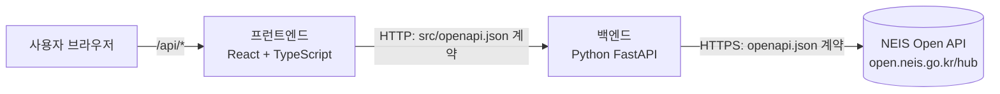
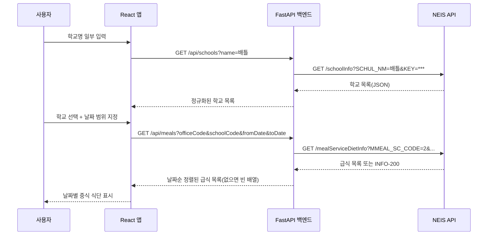

# 급식 배틀 - 학교 급식 조회 앱 (TRD)

이 문서는 [`PRD.md`](./PRD.md)의 요구사항을 구현하기 위한 기술 설계를 정의합니다.

## 1. 시스템 구성



- **프런트엔드(React)**: UI와 3단계 사용자 흐름을 담당합니다.
- **백엔드(Python)**: NEIS API 호출, 응답 정규화, 검증, 오류 변환을 담당합니다.
- 두 앱은 **Docker Compose**로 함께 빌드·실행합니다.

### 1.1 디렉터리 구조

```text
/
├── openapi.json           NEIS 외부 API 명세(원본, 수정 금지)
├── src/
│   ├── openapi.json       프런트엔드 ↔ 백엔드 계약(자체 정의)
│   ├── web/               React + TypeScript + Vite 프런트엔드
│   ├── api/               Python FastAPI 백엔드
│   └── e2e/               Playwright E2E 테스트
├── docker-compose.yml
├── PRD.md
└── TRD.md
```

## 2. 책임 분리와 제약

### 2.1 프런트엔드 (React)

- 화면 렌더링, 입력 검증(길이·날짜 범위), 단계 전환 상태 관리를 담당합니다.
- **제약: 브라우저는 NEIS API를 직접 호출하지 않습니다.** 모든 데이터는 백엔드의
  `/api/*` 엔드포인트를 통해서만 조회합니다. 이는 API 키 노출 방지, CORS 문제 회피,
  응답 정규화 책임을 서버로 모으기 위함입니다.
- **제약: 컴포넌트에서 `fetch`를 직접 호출하지 않습니다.** `src/web/src/lib/api.ts`의
  API 클라이언트 래퍼만 사용합니다.
- 이 클라이언트 코드는 `src/openapi.json` 명세를 근거로 별도 구현합니다.

### 2.2 백엔드 (Python)

- `src/openapi.json`에 정의된 엔드포인트를 구현하여 프런트엔드에 제공합니다.
- `openapi.json` 명세를 근거로 NEIS API 클라이언트 코드를 별도 구현하며,
  외부 HTTP 호출은 이 클라이언트(`app/neis_client.py`)를 통해서만 수행합니다.
- NEIS 응답을 앱 도메인 모델로 정규화하고, 오류를 일관된 오류 응답으로 변환합니다.
- `NEIS_API_KEY`를 환경 변수로 보관하며 응답·로그에 노출하지 않습니다.

## 3. 외부 API 연동 (`openapi.json` 기반)

베이스 URL: `https://open.neis.go.kr/hub`

| 용도 | 경로 | 주요 파라미터 |
| --- | --- | --- |
| 학교 검색 | `GET /schoolInfo` | `KEY`, `Type=json`, `pIndex`, `pSize`, `SCHUL_NM`(부분 일치) |
| 급식 조회 | `GET /mealServiceDietInfo` | `KEY`, `Type=json`, `ATPT_OFCDC_SC_CODE`, `SD_SCHUL_CODE`, `MMEAL_SC_CODE=2`, `MLSV_FROM_YMD`, `MLSV_TO_YMD` |

구현 규칙

- 급식 종류는 항상 중식(`MMEAL_SC_CODE=2`)으로 고정합니다.
- 날짜는 `YYYYMMDD` 형식으로 변환해 전달합니다.
- NEIS는 결과 없음을 `RESULT.CODE = INFO-200`으로 반환합니다. 백엔드는 이를
  오류가 아닌 **빈 목록**으로 변환합니다.
- 그 외 NEIS 오류 코드는 백엔드 오류 응답으로 매핑하며, 원본 메시지에 키가 포함될 수
  있으므로 그대로 노출하지 않습니다.
- 요청 타임아웃(기본 10초)과 제한적 재시도를 적용합니다.
- 파라미터와 필드명은 `openapi.json` 계약과 일치해야 하며 코드에 스키마를
  중복 정의하지 않습니다.

## 4. 내부 API 계약 (`src/openapi.json`)

프런트엔드와 백엔드가 공유하는 단일 계약입니다. 어느 한쪽에만 존재하는 필드를
임의로 추가하지 않습니다.

### 4.1 `GET /api/schools`

| 쿼리 | 타입 | 설명 |
| --- | --- | --- |
| `name` | string (min 2) | 학교명 부분 문자열 |
| `page` | integer (기본 1) | 페이지 번호 |
| `size` | integer (기본 50, 최대 100) | 페이지 크기 |

응답 `200`:

```json
{
  "items": [
    {
      "officeCode": "J10",
      "officeName": "경기도교육청",
      "schoolCode": "7530575",
      "schoolName": "배틀초등학교",
      "schoolKind": "초등학교",
      "address": "경기도 성남시 ..."
    }
  ],
  "totalCount": 1
}
```

### 4.2 `GET /api/meals`

| 쿼리 | 타입 | 설명 |
| --- | --- | --- |
| `officeCode` | string | 시도교육청코드 |
| `schoolCode` | string | 표준학교코드 |
| `fromDate` | string `YYYY-MM-DD` | 시작일 |
| `toDate` | string `YYYY-MM-DD` | 종료일(시작일로부터 최대 31일) |

응답 `200`:

```json
{
  "items": [
    {
      "date": "2026-08-17",
      "mealType": "중식",
      "dishes": ["기장밥", "미역국", "제육볶음"],
      "calorie": "812.3 Kcal",
      "origin": "쌀 : 국내산"
    }
  ]
}
```

### 4.3 `GET /api/health`

컨테이너 헬스체크용 상태 확인 엔드포인트입니다.

### 4.4 오류 응답

모든 오류는 동일한 형태를 사용합니다.

```json
{ "error": { "code": "INVALID_DATE_RANGE", "message": "종료일은 시작일 이후여야 합니다." } }
```

| HTTP | 코드 | 상황 |
| --- | --- | --- |
| 400 | `INVALID_QUERY` | 검색어 길이 미달 등 잘못된 입력 |
| 400 | `INVALID_DATE_RANGE` | 종료일 < 시작일 |
| 400 | `DATE_RANGE_TOO_LONG` | 31일 초과 |
| 502 | `UPSTREAM_ERROR` | NEIS API 오류 |
| 504 | `UPSTREAM_TIMEOUT` | NEIS API 응답 지연 |

## 5. 데이터 흐름



상태 관리: 선택한 학교와 날짜 범위는 프런트엔드 상태에 보관하며 서버 세션은
사용하지 않습니다. 급식 데이터는 저장하지 않고 요청 시마다 조회합니다.

## 6. 기술 스택

| 영역 | 기술 |
| --- | --- |
| 프런트엔드 | React 18+, TypeScript, Vite |
| 백엔드 | Python 3.12+, FastAPI, httpx(비동기), Pydantic |
| 패키지 관리 | npm(웹/E2E), uv(Python) |
| 오케스트레이션 | Docker, Docker Compose |
| 테스트 | Vitest + React Testing Library + MSW, pytest + respx, Playwright |

## 7. Docker Compose 구성

```yaml
services:
  api:
    build: ./src/api
    environment:
      - NEIS_API_KEY=${NEIS_API_KEY}
      - CORS_ORIGINS=http://localhost:3000
    ports:
      - "8000:8000"
    healthcheck:
      test: ["CMD", "python", "-c", "import urllib.request;urllib.request.urlopen('http://localhost:8000/api/health')"]
      interval: 10s
      retries: 5
  web:
    build: ./src/web
    ports:
      - "3000:80"
    depends_on:
      api:
        condition: service_healthy
```

- 실행: `docker compose up --build`, 종료: `docker compose down`
- `NEIS_API_KEY`는 저장소 루트 `.env`에서 주입하며 이미지에 굽지 않습니다.
- 웹 컨테이너는 정적 빌드 산출물을 서빙하고 `/api` 경로를 `api` 서비스로 프록시하여
  브라우저가 단일 오리진만 사용하도록 합니다.
- 두 이미지는 멀티스테이지 빌드와 non-root 사용자로 실행합니다.
- CORS 허용 목록은 환경 변수로 관리하며 전체 오리진 허용을 기본값으로 두지 않습니다.

## 8. 테스트 전략

| 계층 | 위치 | 도구 | 모킹 경계 |
| --- | --- | --- | --- |
| 백엔드 단위 | `src/api/tests/unit/` | pytest | 없음(순수 함수) |
| 백엔드 통합 | `src/api/tests/integration/` | pytest + respx + FastAPI TestClient | NEIS HTTP |
| 프런트엔드 통합 | `src/web/src/**/*.test.tsx` | Vitest + RTL + MSW | `/api/*` |
| E2E | `src/e2e/tests/` | Playwright | `/api/*` |

### 8.1 백엔드 단위 테스트

- 날짜 변환(`YYYY-MM-DD` ↔ `YYYYMMDD`), 31일 범위 검증, 종료일 역전 검증
- 메뉴 문자열 파싱(`<br/>` 분리, 알레르기 번호 정리)
- NEIS 응답 → 도메인 모델 정규화, `INFO-200`의 빈 목록 변환

### 8.2 백엔드 통합 테스트

- `respx`로 NEIS HTTP 응답을 모킹하고 `/api/schools`, `/api/meals`를 실제 호출
- 정상 응답, 결과 없음, 잘못된 파라미터(400), 업스트림 오류(502), 타임아웃(504)
- 응답 본문이 `src/openapi.json` 스키마와 일치하는지 검증
- API 키가 응답이나 오류 메시지에 포함되지 않는지 검증

### 8.3 프런트엔드 통합 테스트

- 프런트엔드는 **통합 테스트만** 작성하며 단위 테스트는 두지 않습니다.
- MSW로 `/api/*`를 모킹하고 사용자 관점 시나리오를 검증합니다.
  - 학교 검색 → 결과 목록 렌더링 → 학교 선택
  - 날짜 범위 선택 후 조회 → 날짜별 급식 카드 렌더링
  - 검색 결과 없음, 잘못된 날짜 범위, 급식 정보 없음, API 오류 메시지 표시
  - 로딩 상태 표시

### 8.4 E2E 테스트

- Playwright로 Docker Compose 또는 로컬 서버 위에서 전체 흐름을 검증합니다.
- 실제 NEIS API에는 접속하지 않으며 `/api/*`를 라우트 모킹합니다.
- 시나리오: 학교 검색 → 선택 → 날짜 범위 선택 → 급식 결과 확인,
  결과 없음 흐름, 잘못된 날짜 범위 차단, 이전 단계로 되돌아가기.

### 8.5 공통 원칙

- 테스트는 실제 API 키나 외부 서비스에 접근하지 않습니다.
- 외부 경계에서만 모킹하고 오류 응답 경로도 반드시 검증합니다.

## 9. 보안 및 운영

- `.env`, API 키, 토큰을 커밋하지 않습니다.
- 시크릿을 소스, 테스트 픽스처, URL, 오류 메시지, 로그에 포함하지 않습니다.
- 프런트엔드 번들에 `NEIS_API_KEY`나 내부 서비스 URL을 포함하지 않습니다.
- 로그에는 요청 경로와 상태 코드만 남기고 쿼리스트링의 `KEY`는 마스킹합니다.
- 컨테이너는 non-root 사용자로 실행하고 필요한 포트만 노출합니다.

## 10. 인수 조건

- [ ] React 프런트엔드와 Python 백엔드의 책임이 분리되어 있고, 브라우저에서 NEIS API
      직접 호출이 발생하지 않는다.
- [ ] 백엔드가 `openapi.json` 명세 기반 클라이언트로 NEIS API와 통신한다.
- [ ] 프런트엔드·백엔드 간 통신이 `src/openapi.json` 계약을 따른다.
- [ ] `docker compose up --build`로 두 앱이 함께 빌드·실행된다.
- [ ] 프런트엔드 통합 테스트, 백엔드 단위·통합 테스트, 전체 흐름 E2E 테스트가 존재한다.
